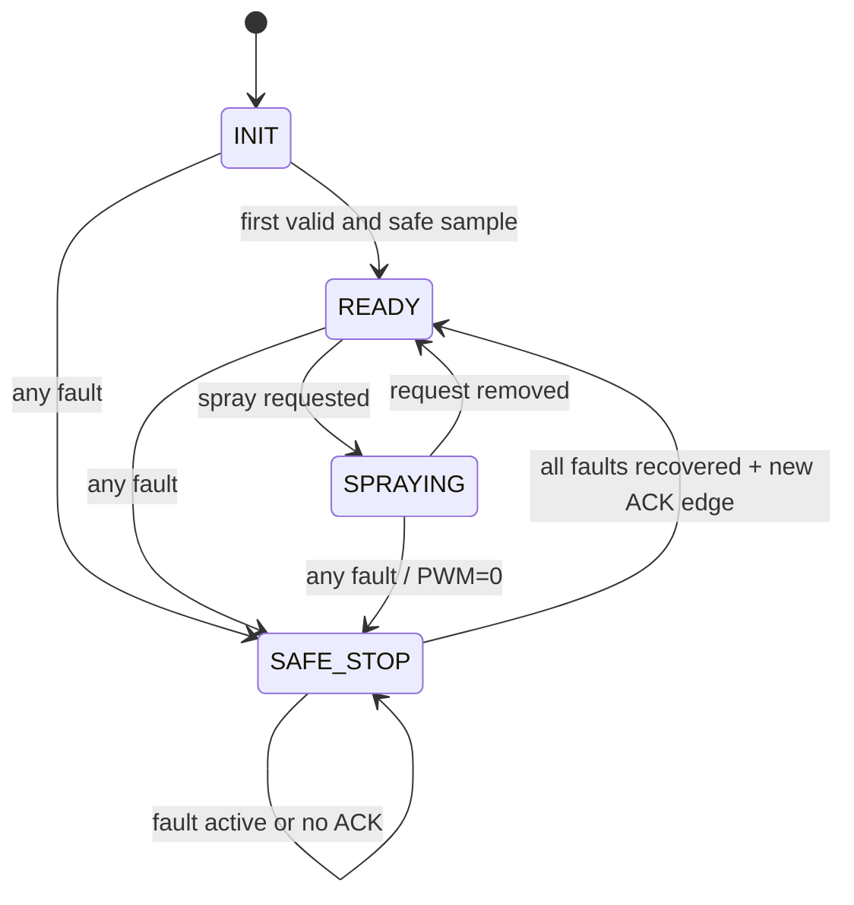

# Portable control core

This directory has no STM32 headers, register access, GPIO, ADC or timer code. `agri_sensor_convert` maps 12-bit simulated ADC counts to engineering values; `agri_control` owns hysteresis, fault bits, latching, acknowledgement and the requested pump percentage.

## State machine

`WARNING` is retained in the public enum for a future non-critical indication but is not entered in this conservative demo: every currently defined fault inhibits spray. Presentation strings are generated outside the core.
