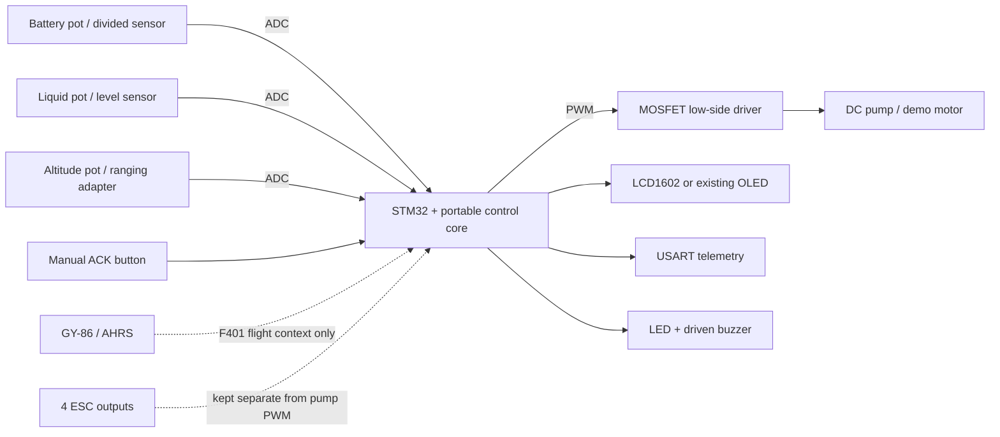

# Hardware design notes

## Safety-oriented signal path

## Power and reset

- F103 demo MCU: regulated 3.3 V on every VDD and VDDA, every VSS/VSSA to GND. Place 100 nF at each supply pair and 4.7 µF bulk capacitance near the MCU. Do not power a pump from the MCU rail.
- Analog potentiometers use the same 3.3 V and ground as VDDA/VSSA so the ADC is ratiometric in the demo.
- BOOT0 has 10 kΩ to GND. NRST has 10 kΩ to 3.3 V and a momentary button to GND. Keep SWDIO/SWCLK accessible.
- The documented 8 MHz crystal uses two nominal 22 pF load capacitors; their real values must be selected from the crystal load specification and board parasitics.

## ADC front end

Proteus pots are explicitly **SIMULATED SENSOR INPUT** devices. Wipers go to PA0, PA1 and PA2. Real F401 integration needs a battery divider sized for the actual maximum pack voltage, RC filtering and input protection; liquid and height adapters require known 0–3.3 V outputs. The demo's linear percentages are not battery chemistry state-of-charge estimation.

## Pump driver

The simulation uses a **DEMO DRIVER MODEL**:

1. PA6 PWM → 100 Ω gate resistor → logic-level N-channel MOSFET gate;
2. 10 kΩ gate-to-GND resistor guarantees off during reset;
3. MOSFET source → GND; drain → motor negative; motor positive → pump supply;
4. flyback diode across motor, cathode at pump positive and anode at drain;
5. pump supply ground and MCU ground join at a common reference.

A real pump design must select MOSFET voltage/current/thermal ratings, diode or TVS, wiring, fuse and EMI suppression from measured stall current and supply transients. The suggested Proteus parts demonstrate switching only.

## Alarm drivers

PB1 drives an LED through 330 Ω. PB0 drives an NPN base through 1 kΩ, with a 10 kΩ base pulldown; the buzzer is on the collector side. Select an active buzzer and transistor flyback protection if the chosen buzzer is inductive.

## Display electrical note

The LCD1602 is wired write-only (`RW` to GND), preventing a 5 V LCD from driving its data bus back into the 3.3 V MCU. Confirm the selected LCD model accepts 3.3 V logic-high; otherwise power it at 3.3 V if supported or add a level shifter.
